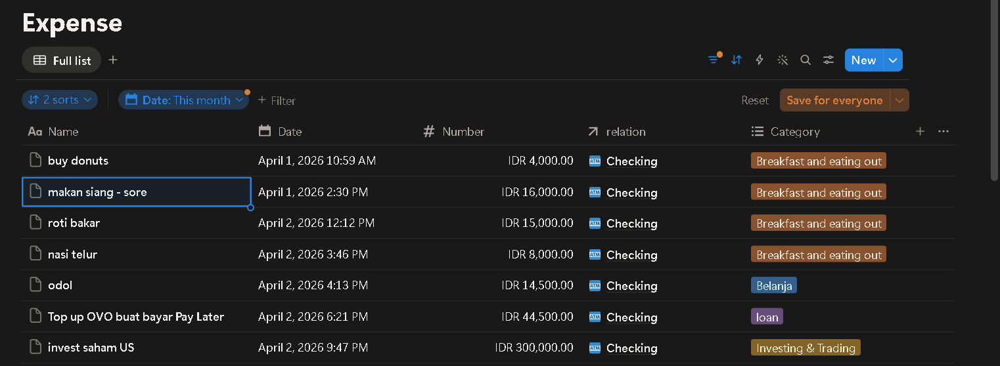
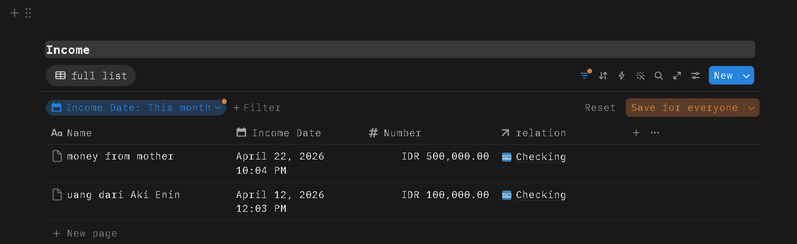

# AI-Powered Expense Tracker: Frictionless Financial Logging

### The Problem
Consistent expense tracking often fails not because the tools are bad, but because the logging process introduces too much friction. Opening an app, navigating menus, typing amounts, and manually selecting categories takes time—leading to forgotten transactions and incomplete financial data.

### The Solution
This project eliminates that friction by allowing you to log expenses as naturally as texting a friend. Built with **Telegram**, **n8n**, **Google Gemini**, and **Notion**, this system processes casual, unstructured messages, extracts the necessary financial data, and automatically routes it into the correct database.

### System Architecture
1. **Frontend / Interface:** Telegram Bot (User input via natural language)
2. **Orchestrator:** n8n (Workflow automation and data routing)
3. **NLP Engine:** Google Gemini API (Data extraction and structured JSON formatting)
4. **Database:** Notion API (Structured storage for Income and Expenses)

### Core Features
- **Zero-Friction Logging:** No rigid formats required. Just send a natural message like *"makan siang 15rb pake qris"* or *"bought coffee for 7,200 via QRIS"*.
- **Bilingual Context Switching:** The prompt engineering dynamically detects language intent. The bot processes both casual Indonesian slang and conversational English, providing localized confirmation replies based on the exact input language.
- **Intelligent Routing & Categorization:** The LLM automatically categorizes the transaction and determines the account (e.g., recognizing QRIS/transfers as "Checking" and physical money as "Cash"). n8n then handles the logic to route the data to the respective Income or Expense database in Notion.

### Visual Showcase

#### 1. System Logic (n8n Workflow)

*The end-to-end automation pipeline connecting Telegram, Gemini, and Notion.*

#### 2. Natural Language Processing (Bilingual Support)
| Indonesian (Casual/Slang) | English (Conversational) |
| :---: | :---: |
|  |  |
| *Processing "makan siang 15rb"* | *Processing "bought coffee for 7,200"* |

#### 3. Automated Database Entry (Notion)
| Expense Tracking | Income Tracking |
| :---: | :---: |
|  |  |
| *Real-time expense categorization* | *Automated income logging* |

### Limitations & Future Roadmap (v2.0)
**Current Limitation (v1.0):** It still depends on active user input. Even though sending a quick chat feels fast, you still need to remember to do it after every transaction. The system runs on a Telegram trigger, so it’s only semi-automated. In the end, human memory stays the single point of failure in logging the data.

**Next Update (v2.0):** To achieve true *Zero-Click Automation*, I plan to implement an email parsing workflow. The system will automatically intercept and read digital receipts from bank email notifications, logging them silently into Notion without requiring any manual input via Telegram.
